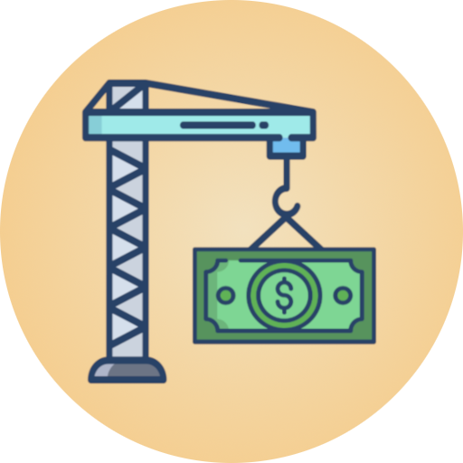

  

<h3 align ="center"> Budget Builder </h3>
<h4 align = "center">
  Budget Builder is a gamified budgeting app. Build and decorate your in-app room by meeting your daily budgeting target.
</h4>

<!-- TABLE OF CONTENTS -->

  
Table of Contents

  <ol>
    <li><a href="#authors">Authors</a></li>
    <li><a href="#libraries">Libraries</a></li>
    <li><a href="#assets">Assets</a></li>
  </ol>

## Authors
- [Lim, Jan Marvin](https://github.com/J-Marvin)
- [Sanson, Ralph Matthew](https://github.com/SansRalph)
- [Tan, Vanessa Marie](https://github.com/vanessa-tan09)

## Libraries
| Library | Link |
| ------- | ---- |
| Charts | [MPAndroidChart by Philipp Jahoda](https://weeklycoding.com/mpandroidchart/) |

## Assets
| Asset | Link |
| ------| -----|
| Font | [Inter](https://fonts.google.com/specimen/Inter) |
| Furniture | [Kenny Furniture Pack](https://opengameart.org/content/furniture-kit)   [Temporary Bedroom](https://favpng.com/png_view/design-interior-design-services-isometric-projection-living-room-png/T9Chxzw7) |
| Icons | [Flaticon](https://www.flaticon.com)
